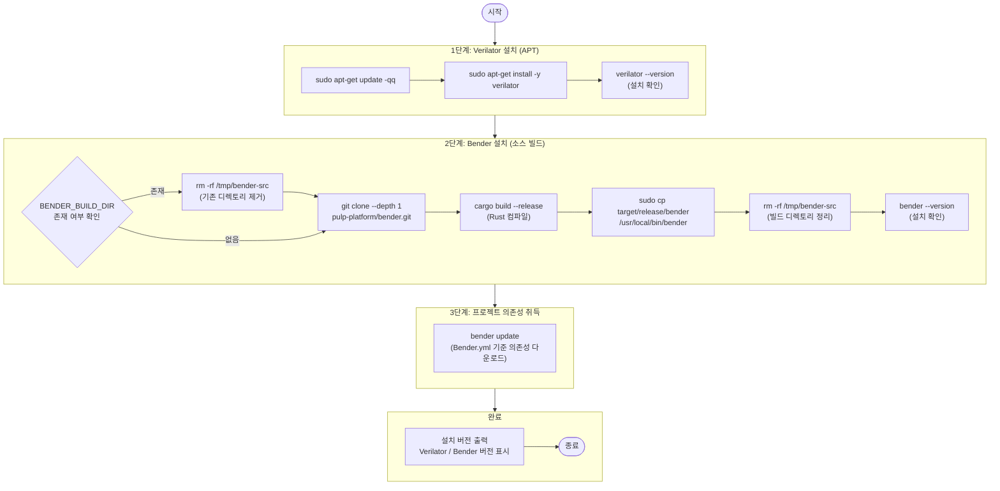

# install_tools.sh — 개발 도구 설치 스크립트

## 1. 개요

`install_tools.sh`는 `axi2per` 프로젝트 개발에 필요한 두 가지 핵심 도구를 설치하는 쉘 스크립트입니다.

| 도구 | 역할 |
|---|---|
| **Verilator** | SystemVerilog 린트·시뮬레이션 컴파일러 |
| **Bender** | PULP 프로젝트용 의존성 관리자 (Rust 기반) |

- `set -euo pipefail` — 오류 발생 시 즉시 중단, 미정의 변수 사용 시 오류, 파이프 오류 전파
- 루트 권한(`sudo`) 필요

---

## 2. 실행 방법

```bash
bash scripts/install_tools.sh
```

---

## 3. 실행 흐름 블록 다이어그램



---

## 4. 단계별 상세 설명

### 4-1. Verilator 설치

```bash
sudo apt-get update -qq
sudo apt-get install -y verilator
verilator --version
```

- APT 패키지 관리자를 통해 설치 (Ubuntu/Debian 계열)
- `-qq`: 조용한 모드 (출력 최소화)
- `-y`: 사용자 확인 없이 자동 수락

### 4-2. Bender 설치 (소스 빌드)

```bash
BENDER_REPO="https://github.com/pulp-platform/bender.git"
BENDER_BUILD_DIR="/tmp/bender-src"
```

| 변수 | 값 | 설명 |
|---|---|---|
| `BENDER_REPO` | GitHub URL | Bender 공식 저장소 |
| `BENDER_BUILD_DIR` | `/tmp/bender-src` | 임시 빌드 디렉토리 |

빌드 과정:
1. 기존 `/tmp/bender-src` 제거 (있을 경우)
2. `git clone --depth 1` — 최신 커밋만 클론 (빠른 다운로드)
3. `cargo build --release` — Rust 릴리즈 빌드 (최적화 포함)
4. `/usr/local/bin/bender`에 설치
5. 빌드 디렉토리 삭제

### 4-3. 의존성 취득

```bash
bender update
```

`Bender.yml`에 선언된 의존성 패키지를 `.bender/` 디렉토리에 다운로드합니다.

현재 `Bender.yml` 의존성:
```yaml
dependencies:
  axi_slice: { git: "https://github.com/chorus96/axi_slice.git", version: 1.1.4 }
```

---

## 5. 사전 요구사항

| 요구사항 | 확인 방법 |
|---|---|
| Ubuntu/Debian 계열 OS | `lsb_release -a` |
| `sudo` 권한 | `sudo -v` |
| Rust 툴체인 (cargo) | `cargo --version` |
| Git | `git --version` |
| 인터넷 연결 | GitHub 접근 필요 |

---

## 6. 예상 출력

```
=== Installing Verilator ===
Verilator 5.020 2023-10-08 rev UNKNOWN.DEV.HASH

=== Installing Bender (build from source) ===
Cloning into '/tmp/bender-src'...
   Compiling bender v0.31.0
    Finished release [optimized] target(s) in 45.2s

=== Fetching project dependencies with Bender ===
Updating dependencies...

All tools installed successfully!
  Verilator: Verilator 5.020 ...
  Bender:    bender 0.31.0
```

---

## 7. 오류 처리

`set -euo pipefail` 설정으로 다음 오류 발생 시 스크립트가 즉시 종료됩니다:

| 상황 | 종료 원인 |
|---|---|
| APT 업데이트 실패 | `set -e` (오류 코드 반환) |
| `cargo build` 실패 | `set -e` |
| `sudo` 권한 없음 | `set -e` |
| Git clone 실패 | `set -e` |
| `bender update` 실패 | `set -e` |
