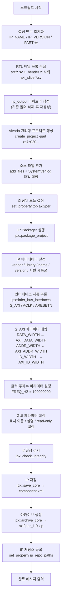

# package_ip.tcl — AMD Vivado IP 패키징 스크립트

## 1. 개요

`package_ip.tcl`은 `axi2per` RTL 모듈을 **AMD Vivado IP Catalog**에서 사용 가능한 커스텀 IP로 패키징하는 Tcl 스크립트입니다.

Vivado 배치 모드 또는 Tcl 콘솔에서 실행하면 다음 결과물을 생성합니다:

| 결과물 | 경로 | 설명 |
|---|---|---|
| IP 디렉토리 | `ip_output/axi2per/` | IP Catalog에서 직접 임포트 가능한 패키지 폴더 |
| IP 아카이브 | `ip_output/axi2per_1.0.zip` | 배포용 압축 파일 |

---

## 2. 사용법

### 배치 모드 (권장)

```bash
vivado -mode batch -source scripts/package_ip.tcl
```

### Tcl 콘솔 모드

```bash
vivado -mode tcl -source scripts/package_ip.tcl
```

### 사전 조건

1. **Bender 의존성 취득**: `bender update` 실행 (`.bender/` 캐시 생성)
2. **PART 설정**: 스크립트 상단의 `PART` 변수를 타깃 FPGA 파트 번호로 수정
3. **Vivado 환경**: Vivado 2020.x 이상 권장 (IP Packager 포함)

---

## 3. 설정 변수

스크립트 상단의 설정 변수를 필요에 따라 수정합니다:

| 변수 | 기본값 | 설명 |
|---|---|---|
| `IP_NAME` | `axi2per` | IP 이름 |
| `IP_VERSION` | `1.0` | IP 버전 |
| `IP_VENDOR` | `user.org` | 벤더 식별자 |
| `IP_LIBRARY` | `user` | IP 라이브러리 이름 |
| `IP_TAXONOMY` | `/UserIP` | IP Catalog 분류 경로 |
| `IP_DISPLAY` | `AXI to PULP Peripheral Bridge` | IP Catalog 표시 이름 |
| `IP_DESCRIPTION` | (기능 설명) | IP 설명 문자열 |
| `PART` | `xc7z020clg484-1` | 타깃 FPGA 파트 (변경 필요) |
| `REPO_ROOT` | 스크립트 위치 기준 자동 계산 | 프로젝트 루트 경로 |

---

## 4. 동작 흐름



---

## 5. 단계별 설명

### 5-1. RTL 파일 수집

```tcl
set RTL_FILES [list \
    "${REPO_ROOT}/src/axi2per_req_channel.sv" \
    "${REPO_ROOT}/src/axi2per_res_channel.sv" \
    "${REPO_ROOT}/src/axi2per.sv"             \
]

# Bender 캐시에서 axi_slice 의존성 파일 자동 탐색
set BENDER_SRC [glob -nocomplain \
    "${REPO_ROOT}/.bender/git/checkouts/axi_slice-*/src/*.sv"]
```

- 프로젝트 RTL 파일 3개 + Bender가 취득한 `axi_slice` 서브모듈 파일을 자동으로 포함합니다.
- `bender update`를 먼저 실행하지 않으면 `BENDER_SRC`가 비어 WARNING이 출력됩니다.

### 5-2. Vivado 프로젝트 생성

```tcl
create_project -force ${IP_NAME}_prj "${REPO_ROOT}/ip_output/${IP_NAME}_prj" -part $PART
set_property target_language SystemVerilog [current_project]
add_files -norecurse $ALL_FILES
set_property file_type SystemVerilog [get_files *.sv]
set_property top axi2per [current_fileset]
```

### 5-3. IP Packager 실행

```tcl
ipx::package_project \
    -root_dir    $IP_OUT_DIR \
    -vendor      $IP_VENDOR  \
    -library     $IP_LIBRARY \
    -taxonomy    $IP_TAXONOMY \
    -import_files \
    -set_current_ip
```

### 5-4. 인터페이스 자동 추론

```tcl
ipx::infer_bus_interfaces xilinx.com:interface:aximm_rtl:1.0 $core  ;# S_AXI
ipx::infer_bus_interfaces xilinx.com:signal:clock_rtl:1.0    $core  ;# ACLK
ipx::infer_bus_interfaces xilinx.com:signal:reset_rtl:1.0    $core  ;# ARESETN
```

`axi2per.sv`의 포트 명명 규칙(`s_axi_*`, `aclk`, `aresetn`)과 `X_INTERFACE_INFO` 속성을 기반으로 Vivado가 인터페이스를 자동으로 인식합니다.

### 5-5. S_AXI 버스 파라미터 매핑

```tcl
set_property value "AXI_DATA_WIDTH" \
    [ipx::get_bus_parameters -of_objects $s_axi_if DATA_WIDTH]
set_property value "AXI_ADDR_WIDTH" \
    [ipx::get_bus_parameters -of_objects $s_axi_if ADDR_WIDTH]
set_property value "AXI_ID_WIDTH"   \
    [ipx::get_bus_parameters -of_objects $s_axi_if ID_WIDTH]
```

AXI 인터페이스의 `DATA_WIDTH`/`ADDR_WIDTH`/`ID_WIDTH` 파라미터를 모듈 파라미터(`AXI_DATA_WIDTH` 등)와 연결합니다.

### 5-6. GUI 파라미터 설정

```tcl
# PER_ID_WIDTH: AXI_ID_WIDTH에서 자동 계산되므로 읽기 전용으로 설정
set_property value_resolve_type immediate $pid
set_property enablement_value false $pid
```

IP Customization 대화상자에서 사용자가 편집 가능한 파라미터와 자동 계산 파라미터를 구분합니다.

---

## 6. 출력 결과

```
ip_output/
├── axi2per/                  ← IP Catalog 임포트 경로
│   ├── component.xml         ← IP 메타데이터 (VLNV, 인터페이스, 파라미터)
│   ├── src/                  ← 복사된 RTL 소스
│   └── ...
└── axi2per_1.0.zip           ← 배포용 아카이브
```

---

## 7. Vivado에서 IP 사용

### 방법 1: IP Catalog에 직접 등록

```
Tools → Settings → IP → Repository → (+) 버튼 → ip_output/axi2per/ 선택
```

### 방법 2: Zip 아카이브 배포

```
IP Catalog → Add Repository → ip_output/axi2per_1.0.zip 선택
```

등록 후 IP Catalog에서 **"AXI to PULP Peripheral Bridge"** 를 검색하여 블록 다이어그램에 추가할 수 있습니다.

---

## 8. 지원 FPGA 제품군

`supported_families` 설정:

| 제품군 | 상태 |
|---|---|
| Zynq-7000 (`zynq`) | Production |
| Zynq UltraScale+ (`zynquplus`) | Production |
| Versal (`versal`) | Production |

다른 제품군을 추가하려면 스크립트의 `supported_families` 항목을 수정합니다.

---

## 9. 트러블슈팅

| 증상 | 원인 | 해결 방법 |
|---|---|---|
| `WARNING: No .bender source files found` | `.bender/` 캐시 없음 | `bender update` 실행 |
| `WARNING: S_AXI interface not found` | 포트명 불일치 | `axi2per.sv`의 `s_axi_*` 포트명 확인 |
| IP integrity 경고 | 인터페이스 파라미터 불일치 | Vivado 로그 검토, 파라미터 기본값 확인 |
| `create_project` 실패 | PART 번호 오류 | 설치된 Vivado가 해당 디바이스를 지원하는지 확인 |

---

## 10. 관련 파일

| 파일 | 설명 |
|---|---|
| `src/axi2per.sv` | 최상위 모듈 (`s_axi_*`/`aclk`/`aresetn` 포트, `X_INTERFACE_INFO` 속성) |
| `scripts/verilator_sim.sh` | Verilator 시뮬레이션 실행 |
| `Bender.yml` | `axi_slice` 의존성 선언 |
