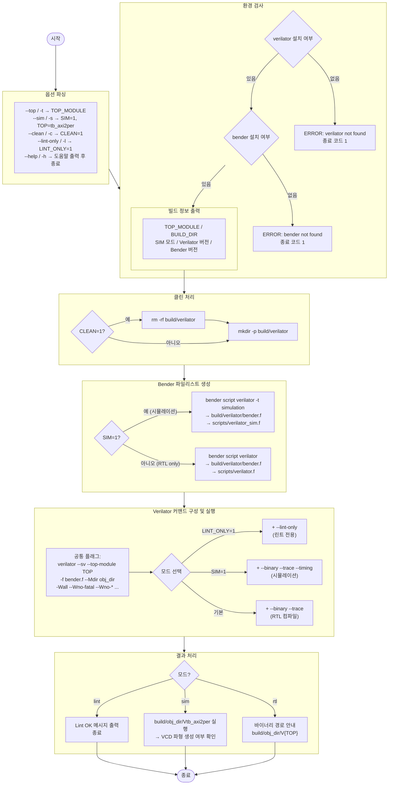

# verilator_sim.sh — Verilator 시뮬레이션 빌드 스크립트

## 1. 개요

`verilator_sim.sh`는 `axi2per` 프로젝트의 Verilator 기반 린트·컴파일·시뮬레이션을 자동화하는 스크립트입니다.

- **Bender**로 소스 파일 목록(`filelist`)을 자동 생성
- **3가지 동작 모드**: 린트 전용 / RTL 컴파일 / 테스트벤치 시뮬레이션
- 빌드 결과물은 `build/verilator/` 디렉토리에 저장
- VCD 파형 파일 자동 생성 (시뮬레이션 모드)

---

## 2. 사용법

```bash
./scripts/verilator_sim.sh [OPTIONS]

옵션:
  -t, --top <MODULE>   최상위 모듈 이름 (기본값: axi2per)
  -s, --sim            테스트벤치(tb_axi2per) 빌드 및 실행
  -c, --clean          빌드 디렉토리 초기화 후 컴파일
  -l, --lint-only      린트만 실행 (바이너리 생성 없음)
  -h, --help           도움말 출력

환경 변수:
  TOP_MODULE           최상위 모듈 이름 재정의
  VLT_ARGS             Verilator에 전달할 추가 인자
```

### 주요 사용 예시

```bash
./scripts/verilator_sim.sh --lint-only          # RTL 린트만 실행
./scripts/verilator_sim.sh --sim                # 시뮬레이션 빌드 + 실행
./scripts/verilator_sim.sh --sim --clean        # 클린 빌드 후 시뮬레이션
./scripts/verilator_sim.sh --top axi2per_req_channel --lint-only
```

---

## 3. 전체 실행 흐름 블록 다이어그램



---

## 4. 동작 모드별 상세

### 4-1. 린트 전용 모드 (`--lint-only`)

```bash
./scripts/verilator_sim.sh --lint-only
```

```
대상 소스: RTL only (axi2per_req_channel.sv, axi2per_res_channel.sv, axi2per.sv)
Bender 타겟: 기본 (simulation 타겟 제외)
Verilator 추가 플래그: --lint-only

출력:
  - 빌드 디렉토리: build/verilator/bender.f
  - 스냅샷: scripts/verilator.f
  - 컴파일 결과물: 없음 (lint만)
```

### 4-2. 시뮬레이션 모드 (`--sim`)

```bash
./scripts/verilator_sim.sh --sim
```

```
TOP_MODULE: tb_axi2per (자동 설정)
대상 소스: RTL + 시뮬레이션 (per_slave_model.sv, tb_axi2per.sv 포함)
Bender 타겟: simulation
Verilator 추가 플래그: --binary --trace --timing

출력:
  - 빌드 디렉토리: build/verilator/bender.f
  - 스냅샷: scripts/verilator_sim.f
  - 바이너리: build/verilator/obj_dir/Vtb_axi2per
  - 파형: sim/tb_axi2per.vcd (생성 시)

실행:
  build/verilator/obj_dir/Vtb_axi2per
```

### 4-3. RTL 컴파일 모드 (옵션 없음)

```bash
./scripts/verilator_sim.sh
./scripts/verilator_sim.sh --top axi2per
```

```
대상 소스: RTL only
Bender 타겟: 기본
Verilator 추가 플래그: --binary --trace

출력:
  - 바이너리: build/verilator/obj_dir/V{TOP_MODULE}
  - 파형 지원 (--trace)
```

---

## 5. 경로 구조

```
axi2per/
├── scripts/
│   ├── verilator_sim.sh          ← 이 스크립트
│   ├── verilator.f               ← RTL 파일리스트 스냅샷 (bender 생성)
│   └── verilator_sim.f           ← 시뮬레이션 파일리스트 스냅샷 (bender 생성)
└── build/
    └── verilator/
        ├── bender.f              ← 현재 빌드의 파일리스트
        └── obj_dir/
            ├── Vtb_axi2per       ← 시뮬레이션 바이너리
            └── V{TOP_MODULE}     ← RTL 컴파일 바이너리
```

---

## 6. Verilator 플래그 상세

### 공통 플래그

| 플래그 | 설명 |
|---|---|
| `--sv` | SystemVerilog 모드 활성화 |
| `--top-module` | 최상위 모듈 지정 |
| `-f bender.f` | Bender 생성 파일리스트 사용 |
| `--Mdir obj_dir` | 출력 디렉토리 지정 |
| `-Wall` | 모든 경고 활성화 |
| `--Wno-fatal` | 경고를 오류로 처리하지 않음 |
| `--error-limit 50` | 최대 오류 출력 수 제한 |

### 억제 경고 목록

| 경고 | 억제 이유 |
|---|---|
| `--Wno-DECLFILENAME` | 서드파티 파일 이름 불일치 |
| `--Wno-PINCONNECTEMPTY` | 미연결 포트 (정상적 사용) |
| `--Wno-UNUSEDSIGNAL` | 미사용 신호 (서드파티) |
| `--Wno-UNUSEDPARAM` | 미사용 파라미터 (서드파티) |
| `--Wno-MULTIDRIVEN` | 다중 드라이브 (서드파티) |
| `--Wno-UNOPTFLAT` | 최적화 불가 신호 (서드파티) |
| `--Wno-GENUNNAMED` | 이름 없는 generate 블록 |
| `--Wno-CMPCONST` | 상수 비교 (서드파티) |
| `--Wno-TIMESCALEMOD` | timescale 혼재 (서드파티) |

### 모드별 추가 플래그

| 모드 | 추가 플래그 | 설명 |
|---|---|---|
| 린트 | `--lint-only` | 바이너리 생성 없이 문법·의미 검사만 |
| 시뮬레이션 | `--binary --trace --timing` | 실행 바이너리 + VCD 파형 + `$delay`/`wait` 지원 |
| RTL 컴파일 | `--binary --trace` | 실행 바이너리 + VCD 파형 |

> **`--timing`**: Verilator 5.x에서 `initial begin ... wait(...)` 등 시간 기반 구조를 코루틴으로 처리. 테스트벤치에 필수.

---

## 7. Bender 파일리스트 구조

`bender script verilator`가 생성하는 `.f` 파일 예시:

```
+incdir+<include_dir>
<source_file_1>.sv
<source_file_2>.sv
...
```

시뮬레이션 타겟(`-t simulation`) 시 추가:
```
sim/per_slave_model.sv
sim/tb_axi2per.sv
```

---

## 8. 환경 변수

| 변수 | 기본값 | 설명 |
|---|---|---|
| `TOP_MODULE` | `axi2per` | 최상위 모듈 이름 (`--sim` 시 자동으로 `tb_axi2per`) |
| `VLT_ARGS` | `""` | Verilator에 전달할 추가 플래그 |

사용 예시:
```bash
VLT_ARGS="--debug" ./scripts/verilator_sim.sh --lint-only
TOP_MODULE=axi2per_req_channel ./scripts/verilator_sim.sh --lint-only
```

---

## 9. 예상 출력

### 시뮬레이션 모드 (`--sim`)

```
=== Verilator Simulation Build ===
  Top module : tb_axi2per
  Build dir  : /home/user/axi2per/build/verilator
  Sim mode   : 1
  Verilator  : Verilator 5.020 ...
  Bender     : bender 0.31.0

--- Generating Verilator filelist with bender ---
    Filelist (sim): /home/user/axi2per/build/verilator/bender.f

--- Running Verilator ---
    Mode: simulation (tb_axi2per)
    Running: verilator --sv --top-module tb_axi2per ...

=== Build complete — running simulation ===

--- Test 1: aw_user=0x15, ar_user=0x15 ---
  [per_req] per_id=00000010  per_user=0x15  (we=1  addr=0x00000080)
    b_user=0x15  <- matches aw_user=0x15  OK
...
ALL TESTS PASSED: user field correctly propagated AXI ↔ peripheral

    Waveform: sim/tb_axi2per.vcd
```

### 린트 모드 (`--lint-only`)

```
=== Verilator Simulation Build ===
  Top module : axi2per
  ...

--- Running Verilator ---
    Mode: lint-only
    Running: verilator --sv --top-module axi2per ... --lint-only

=== Lint passed successfully ===
```

---

## 10. 클린 빌드 사용 시나리오


