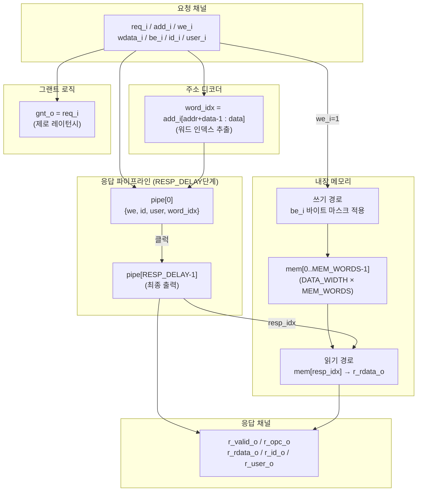

# per_slave_model.sv — PULP 주변장치 슬레이브 시뮬레이션 모델

## 1. 개요

`per_slave_model`은 PULP 주변장치(peripheral) 슬레이브 프로토콜을 구현하는 **시뮬레이션 전용** 모델입니다.  
실제 메모리를 내장하여 읽기/쓰기를 처리하고, 파이프라인 지연(`RESP_DELAY`) 후 응답을 생성합니다.  
`axi2per` 브리지의 검증 테스트벤치(`tb_axi2per.sv`)와 함께 사용됩니다.

### 주요 특징
- **PULP 표준 `we` 극성**: `we_i=1` → 쓰기, `we_i=0` → 읽기
- **제로 레이턴시 그랜트**: `gnt_o = req_i` (즉시 수락)
- **파이프라인 응답**: RESP_DELAY 클럭 후 r_valid 어서트
- **ID/user 에코**: 요청의 id_i, user_i를 응답의 r_id_o, r_user_o로 그대로 반환
- **바이트 단위 쓰기**: be_i(바이트 인에이블)에 따라 선택적 쓰기

---

## 2. 파라미터

| 파라미터 | 기본값 | 설명 |
|---|---|---|
| `ADDR_WIDTH` | 32 | 주소 버스 폭 (비트) |
| `DATA_WIDTH` | 256 | 데이터 버스 폭 (비트) |
| `PER_ID_WIDTH` | 5 | 원-핫 ID 폭 (비트) |
| `USER_WIDTH` | 6 | user 필드 폭 (비트) |
| `MEM_WORDS` | 256 | 메모리 워드 수 |
| `RESP_DELAY` | 1 | 응답 파이프라인 지연 (클럭 수) |

---

## 3. 포트

### 요청 채널 (입력)

| 포트 | 폭 | 설명 |
|---|---|---|
| `clk_i` | 1 | 시스템 클럭 |
| `rst_ni` | 1 | 비동기 액티브-로우 리셋 |
| `req_i` | 1 | 요청 유효 |
| `add_i` | ADDR_WIDTH | 요청 주소 |
| `we_i` | 1 | 1=쓰기, 0=읽기 |
| `wdata_i` | DATA_WIDTH | 쓰기 데이터 |
| `be_i` | DATA_WIDTH/8 | 바이트 인에이블 |
| `id_i` | PER_ID_WIDTH | 트랜잭션 ID (원-핫) |
| `user_i` | USER_WIDTH | user 필드 |

### 응답 채널 (출력)

| 포트 | 폭 | 설명 |
|---|---|---|
| `gnt_o` | 1 | 그랜트 (항상 req_i와 동일) |
| `r_valid_o` | 1 | 응답 유효 |
| `r_opc_o` | 1 | 응답 opcode (항상 0) |
| `r_rdata_o` | DATA_WIDTH | 읽기 데이터 (읽기 트랜잭션시만 유효) |
| `r_id_o` | PER_ID_WIDTH | 에코된 원-핫 ID |
| `r_user_o` | USER_WIDTH | 에코된 user 필드 |

---

## 4. 블록 다이어그램



---

## 5. 동작 상세

### 5-1. 주소 디코더

```systemverilog
// 바이트 주소 → 워드 인덱스 변환
// DATA_WIDTH=512 → DATA_WIDTH/8=64 bytes per word → $clog2(64)=6
// MEM_WORDS=256 → $clog2(256)=8
assign word_idx = add_i[$clog2(MEM_WORDS)+$clog2(DATA_WIDTH/8)-1 : $clog2(DATA_WIDTH/8)];
// 예: DATA_WIDTH=512, MEM_WORDS=256 → add_i[13:6]
```

### 5-2. 그랜트 (제로 레이턴시)

```systemverilog
assign gnt_o = req_i;  // 항상 즉시 수락
```

### 5-3. 응답 파이프라인

```systemverilog
// PIPE_W = 1 + PER_ID_WIDTH + USER_WIDTH + $clog2(MEM_WORDS)
// 파이프라인에 저장: {we_i, id_i, user_i, word_idx}
// RESP_DELAY=1이면: 요청 후 1클럭 뒤에 r_valid=1

for (gi = 0; gi < RESP_DELAY; gi++) begin
    // gi==0: 입력에서 직접 래치
    // gi>0: 이전 스테이지에서 전달
end
```

### 5-4. 파이프라인 언팩

```systemverilog
wire resp_we   = pipe_data[RESP_DELAY-1][PIPE_W-1];           // MSB: we
wire resp_id   = pipe_data[RESP_DELAY-1][PIPE_W-2 -: PER_ID_WIDTH];
wire resp_user = pipe_data[RESP_DELAY-1][PIPE_W-2-PER_ID_WIDTH -: USER_WIDTH];
wire resp_idx  = pipe_data[RESP_DELAY-1][$clog2(MEM_WORDS)-1:0]; // LSB: word_idx
```

### 5-5. 읽기/쓰기 응답

```systemverilog
// 읽기: r_valid 사이클에 mem 데이터 출력
assign r_rdata_o = (r_valid_o && !resp_we) ? mem[resp_idx] : '0;

// ID/user 에코
assign r_id_o   = r_valid_o ? resp_id   : '0;
assign r_user_o = r_valid_o ? resp_user : '0;

// 쓰기: 요청 수신 즉시 (gnt=1 사이클) 메모리에 기록
always_ff @(posedge clk_i) begin
    if (req_i && gnt_o && we_i) begin
        for (int b = 0; b < DATA_WIDTH/8; b++)
            if (be_i[b]) mem[word_idx][8*b +: 8] <= wdata_i[8*b +: 8];
    end
end
```

---

## 6. 타이밍 다이어그램 (RESP_DELAY=1)

```
클럭:       ↑      ↑      ↑
req_i:      1      0      0
gnt_o:      1      0      0      (제로 레이턴시)
we_i=1:     [쓰기]
  mem_wr:   [this clock]
  r_valid:  0      1      0      (RESP_DELAY=1 → 1클럭 후)
  r_rdata:  X      0      X      (쓰기면 0 반환)

we_i=0:     [읽기]
  r_valid:  0      1      0
  r_rdata:  X   mem[idx]  X      (읽기 데이터 반환)
  r_id:     X   resp_id   X
  r_user:   X   resp_user X
```

---

## 7. 메모리 레이아웃

```
총 용량: MEM_WORDS × DATA_WIDTH 비트
         = 256 × 512 비트 (기본 설정)
         = 16384 바이트 = 16 KB

주소 매핑 (DATA_WIDTH=512, 64바이트/워드):
  주소 0x0000~0x003F → mem[0]
  주소 0x0040~0x007F → mem[1]
  주소 0x0080~0x00BF → mem[2]
  주소 0x0100~0x013F → mem[4]
  ...

초기화: 전체 0으로 초기화
  initial for (int i = 0; i < MEM_WORDS; i++) mem[i] = '0;
```

---

## 8. 파이프라인 데이터 폭 계산

```
PIPE_W = 1 + PER_ID_WIDTH + USER_WIDTH + $clog2(MEM_WORDS)

예: PER_ID_WIDTH=8, USER_WIDTH=6, MEM_WORDS=256
  PIPE_W = 1 + 8 + 6 + 8 = 23 비트

비트 배치:
  [22]      = we_i
  [21:14]   = id_i     (8비트 원-핫 ID)
  [13:8]    = user_i   (6비트)
  [7:0]     = word_idx (8비트)
```
