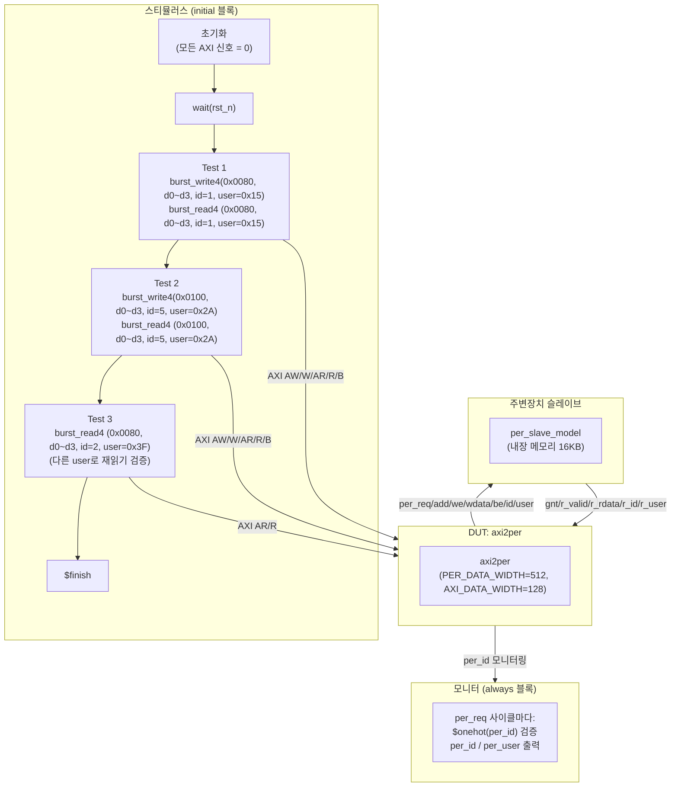
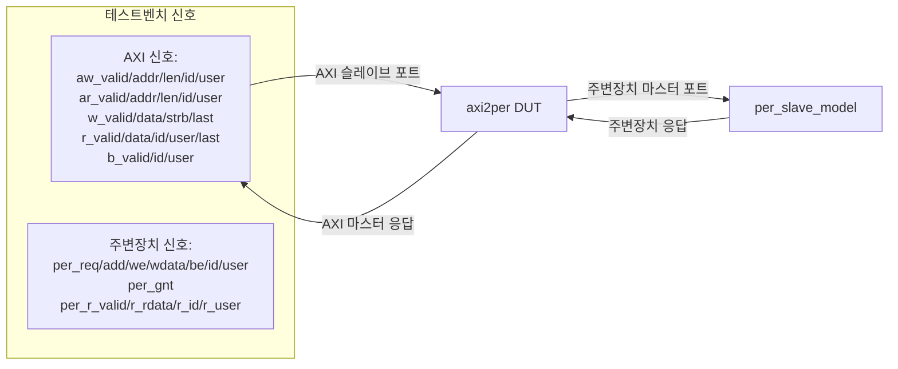
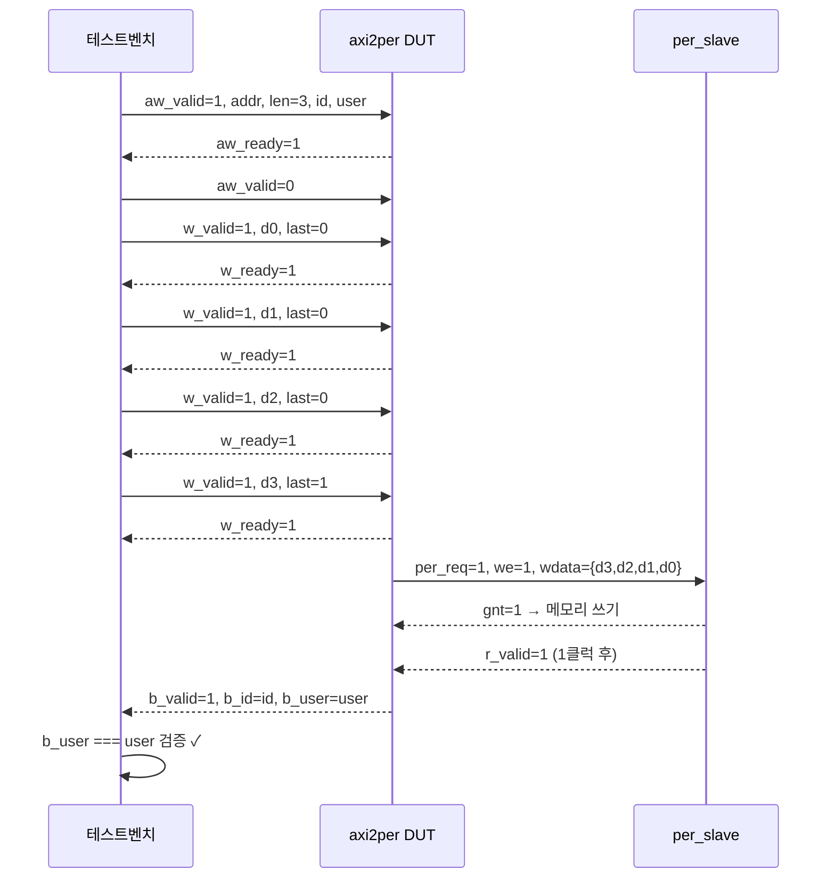
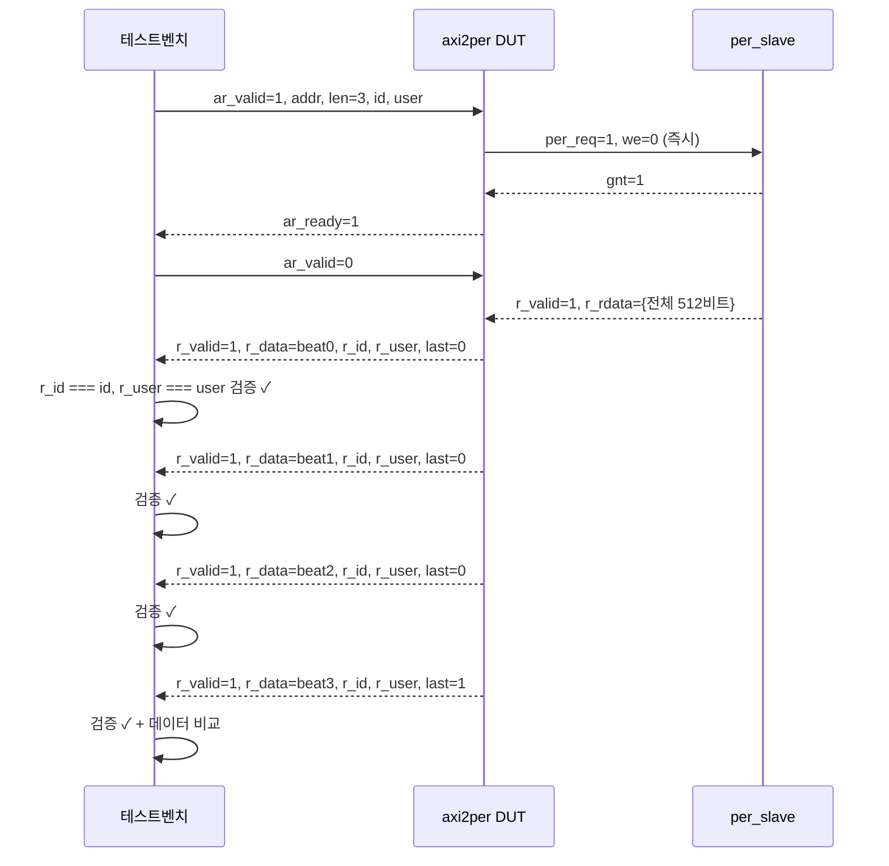

# tb_axi2per.sv — axi2per 통합 테스트벤치

## 1. 개요

`tb_axi2per`는 `axi2per` 브리지 모듈을 검증하는 **Verilator 기반 시뮬레이션 전용** 테스트벤치입니다.

### 검증 대상
- **데이터 정확성**: 4비트 AXI 버스트 쓰기/읽기 데이터 무결성
- **ID 원-핫 인코딩**: 주변장치에 전달되는 `per_id`의 원-핫 검증
- **user 필드 전달**: AXI AW/AR user → 주변장치 → AXI B/R user 왕복 검증

### 테스트 설정

| 파라미터 | 값 | 설명 |
|---|---|---|
| `AXI_ADDR_WIDTH` | 32 | AXI / 주변장치 주소 버스 폭 |
| `AXI_DATA_WIDTH` | 128 | AXI 데이터 버스 폭 |
| `AXI_USER_WIDTH` | 6 | user 필드 폭 |
| `AXI_ID_WIDTH` | 3 | AXI ID 폭 (바이너리) |
| `PER_DATA_WIDTH` | 512 | 주변장치 데이터 버스 폭 |
| `PER_ID_WIDTH` | 8 | 주변장치 ID 폭 (원-핫, 2³=8) |
| `BEAT_RATIO` | 4 | 주변장치 워드당 AXI 비트 수 |
| `BUFFER_DEPTH` | 2 | AXI 채널 버퍼 깊이 |

> `PER_ADDR_WIDTH`는 `localparam = AXI_ADDR_WIDTH`로 파생되므로 별도 설정 불필요

---

## 2. 테스트벤치 구조 블록 다이어그램



---

## 3. 클럭 & 리셋

```systemverilog
logic clk = 0;
always #5 clk = ~clk;          // 10ns 주기 (100 MHz)

logic rst_n;
initial begin
    rst_n = 0;
    repeat(4) @(posedge clk);  // 4클럭 동안 리셋 유지
    rst_n = 1;
end
```

---

## 4. DUT 및 슬레이브 연결



### DUT 파라미터 연결
```systemverilog
// PER_ADDR_WIDTH는 제거됨 — DUT 내부에서 localparam = AXI_ADDR_WIDTH로 자동 설정
axi2per #(
  .PER_DATA_WIDTH(512),
  .PER_ID_WIDTH(8),    // 명시적 원-핫 폭 설정
  .AXI_ADDR_WIDTH(32), .AXI_DATA_WIDTH(128),
  .AXI_USER_WIDTH(6),  .AXI_ID_WIDTH(3),
  .BUFFER_DEPTH(2)
) dut (
  // 포트명: AMD Vivado IP 패키징 호환 명칭 사용
  .aclk(clk), .aresetn(rst_n), .test_en_i(1'b0),
  .s_axi_awvalid(aw_valid), .s_axi_awaddr(aw_addr), ...
);

per_slave_model #(
  .ADDR_WIDTH(32), .DATA_WIDTH(512),
  .PER_ID_WIDTH(8),    // DUT와 동일한 원-핫 폭
  .MEM_WORDS(256), .RESP_DELAY(1)
) per (...);
```

---

## 5. 태스크 정의

### 5-1. burst_write4 — 4비트 AXI 쓰기

```
입력: addr (32비트 주소), d0~d3 (128비트 × 4 = 512비트 데이터)
      id (3비트 AXI ID), user (6비트 user 필드)

동작:
  1. AW 채널: aw_valid=1, len=3(4비트), size=4(16바이트), burst=INCR
     → aw_ready 대기 후 aw_valid=0
  2. W 채널: d0~d3 순서로 전송 (마지막은 w_last=1)
     → 각 비트마다 w_ready 대기
  3. B 채널: b_valid 대기 후 검증
     - b_id === id  (ID 일치 확인)
     - b_user === user  (user 필드 일치 확인)

AW 신호 설정:
  size=3'b100 → 2^4 = 16 bytes (AXI_DATA_WIDTH/8=128/8=16)
  burst=2'b01 → INCR (증가형 버스트)
```



### 5-2. burst_read4 — 4비트 AXI 읽기

```
입력: addr (32비트 주소), e0~e3 (예상 데이터 128비트 × 4)
      id (3비트 AXI ID), user (6비트 user 필드)

동작:
  1. AR 채널: ar_valid=1, len=3, size=4, burst=INCR
     → ar_ready 대기 후 ar_valid=0
  2. R 채널: 4비트 수신
     - 각 비트: r_id === id, r_user === user 검증
  3. 데이터 검증: got[0~3] === e0~e3

검증 항목:
  - r_id 일치 (모든 비트)
  - r_user 일치 (모든 비트, 에코된 ar_user)
  - 데이터 일치 (e0~e3 순서대로)
```



---

## 6. 모니터 (항상 블록)

```systemverilog
always @(posedge clk) begin
    if (rst_n && per_req) begin
        // 원-핫 검증: 실패시 시뮬레이션 강제 종료
        if (!$onehot(per_id))
            $fatal(1, "[ONE-HOT FAIL] per_id=%b (we=%b addr=0x%08h)",
                   per_id, per_we, per_add);
        // 정상: ID/user/주소 출력
        $display("  [per_req] per_id=%b  per_user=0x%02h  (we=%b  addr=0x%08h)",
                 per_id, per_user, per_we, per_add);
    end
end
```

---

## 7. 테스트 케이스 상세

### Test 1: 기본 쓰기 + 읽기 (user=0x15, id=1)

```
목적: 기본적인 4비트 쓰기 후 읽기, user/ID 전달 검증

쓰기:
  주소: 0x0080 (64바이트 정렬, base_slot=0)
  데이터:
    d0 = 128'h1111...1111  (beat0)
    d1 = 128'h2222...2222  (beat1)
    d2 = 128'h3333...3333  (beat2)
    d3 = 128'h4444...4444  (beat3)
  id=1 → per_id=8'b0000_0010 (원-핫)
  user=0x15 → b_user=0x15 검증

읽기:
  주소: 0x0080
  예상: d0~d3 동일 데이터
  id=1, user=0x15 → r_user=0x15 검증 (4비트 모두)
```

### Test 2: 다른 주소/user/ID (user=0x2A, id=5)

```
목적: 독립적인 트랜잭션, 다른 user 값 검증

쓰기:
  주소: 0x0100 (64바이트 정렬, base_slot=0)
  데이터: 다양한 패턴 (AAAA_BBBB..., DEAD_BEEF...)
  id=5 → per_id=8'b0010_0000 (원-핫)
  user=0x2A → b_user=0x2A 검증

읽기:
  주소: 0x0100
  user=0x2A → r_user=0x2A 검증
```

### Test 3: 다른 user로 재읽기 (user=0x3F, id=2)

```
목적: user 필드는 저장되지 않고 요청자가 제공함을 검증
      (이전 트랜잭션의 user 값이 잔류하지 않음)

읽기:
  주소: 0x0080 (Test 1과 동일 주소)
  데이터: Test 1과 동일 데이터 (메모리 내용 그대로)
  id=2 → per_id=8'b0000_0100 (원-핫)
  user=0x3F → r_user=0x3F 검증 (Test 1의 0x15가 아닌 새 값)
```

---

## 8. 주소 정렬 요구사항

```
PER_DATA_WIDTH=512 → PER_BE_WIDTH = 64 바이트
64바이트 경계 정렬 필요:

  base_slot = addr[$clog2(64)-1 : $clog2(16)]
            = addr[5:4]

  addr=0x0080: 0x80 >> 4 = 8, 8 & 3 = 0 → base_slot=0 ✓
  addr=0x0100: 0x100 >> 4 = 16, 16 & 3 = 0 → base_slot=0 ✓

  addr=0x0040: 0x40 >> 4 = 4, 4 & 3 = 0 → base_slot=0 ✓
  addr=0x0050: 0x50 >> 4 = 5, 5 & 3 = 1 → base_slot=1 ✗ (데이터 손실 가능)
```

---

## 9. 시뮬레이션 실행

```bash
# Verilator 컴파일 및 실행
./scripts/verilator_sim.sh --sim

# 예상 출력:
--- Test 1: aw_user=0x15, ar_user=0x15 ---
  [per_req] per_id=00000010  per_user=0x15  (we=1  addr=0x00000080)
    b_user=0x15  <- matches aw_user=0x15  OK
  [per_req] per_id=00000010  per_user=0x15  (we=0  addr=0x00000080)
    r_user=0x15  <- matches ar_user=0x15  OK (all 4 beats)
PASS  [test 1] user=0x15 write+read @ 0x0080 (id=1)

--- Test 2: aw_user=0x2A, ar_user=0x2A, id=5 ---
  [per_req] per_id=00100000  per_user=0x2a  (we=1  addr=0x00000100)
    b_user=0x2a  <- matches aw_user=0x2a  OK
  [per_req] per_id=00100000  per_user=0x2a  (we=0  addr=0x00000100)
    r_user=0x2a  <- matches ar_user=0x2a  OK (all 4 beats)
PASS  [test 2] user=0x2A write+read @ 0x0100 (id=5)

--- Test 3: re-read 0x0080 with ar_user=0x3F, id=2 ---
  [per_req] per_id=00000100  per_user=0x3f  (we=0  addr=0x00000080)
    r_user=0x3f  <- matches ar_user=0x3f  OK (all 4 beats)
PASS  [test 3] user=0x3F re-read @ 0x0080 (id=2)

ALL TESTS PASSED: user field correctly propagated AXI ↔ peripheral
```

---

## 10. 검증 매트릭스

| 항목 | 방법 | 검증 위치 |
|---|---|---|
| 원-핫 ID 인코딩 | `$onehot(per_id)` 런타임 체크 | `always @(posedge clk)` 모니터 |
| 쓰기 user 전달 | `b_user === user` | `burst_write4` 태스크 |
| 읽기 user 전달 | `r_user === user` (전 비트) | `burst_read4` 태스크 |
| 쓰기 ID 반환 | `b_id === id` | `burst_write4` 태스크 |
| 읽기 ID 반환 | `r_id === id` (전 비트) | `burst_read4` 태스크 |
| 쓰기 데이터 | 직접 읽기 후 비교 | `burst_read4` 데이터 비교 |
| 읽기 데이터 | `got[0~3] === e0~e3` | `burst_read4` 태스크 |
| user 독립성 | Test 3 (다른 user로 재읽기) | 별도 재읽기 테스트 |
