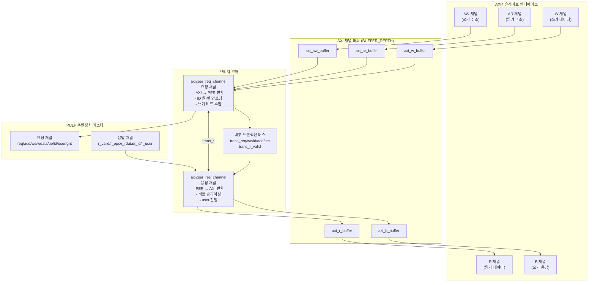

# axi2per.sv — AXI4 to PULP Peripheral 브리지 (최상위 모듈)

## 1. 개요

`axi2per`는 AXI4 슬레이브 인터페이스를 PULP 주변장치(peripheral) 마스터 인터페이스로 변환하는 최상위(top-level) 브리지 모듈입니다.  
AXI4의 읽기/쓰기 트랜잭션을 PULP 주변장치 프로토콜로 번역하며, AXI ID(바이너리 인코딩) → 주변장치 ID(원-핫 인코딩) 변환, 넓은 주변장치 데이터버스(PER_DATA_WIDTH)에 대한 버스트 비트 조합/분해, user 필드 전달을 수행합니다.

---

## 2. 파라미터

| 파라미터 | 기본값 | 설명 |
|---|---|---|
| `AXI_ADDR_WIDTH` | 32 | AXI 주소 버스 폭 (비트) |
| `AXI_DATA_WIDTH` | 64 | AXI 데이터 버스 폭 (비트) |
| `AXI_USER_WIDTH` | 6 | AXI user 신호 폭 (비트) |
| `AXI_ID_WIDTH` | 3 | AXI ID 폭 (비트, 바이너리) |
| `PER_DATA_WIDTH` | 256 | 주변장치 데이터 버스 폭 (비트) |
| `PER_ID_WIDTH` | `2**AXI_ID_WIDTH` | 주변장치 ID 폭 (비트, 원-핫) |
| `BUFFER_DEPTH` | 2 | AXI 채널 버퍼 깊이 |
| `AXI_STRB_WIDTH` | `AXI_DATA_WIDTH/8` | AXI 스트로브 폭 (바이트) |

### 파생 로컬파라미터

| 로컬파라미터 | 계산식 | 설명 |
|---|---|---|
| `PER_ADDR_WIDTH` | `AXI_ADDR_WIDTH` | 주변장치 주소 버스 폭 — AXI와 항상 동일 |

> **원-핫 인코딩**: AXI_ID_WIDTH=3이면 PER_ID_WIDTH=8. AXI ID값 N → 주변장치 ID 비트[N]=1, 나머지=0

---

## 3. 포트

### 3-1. 공통

| 포트 | 방향 | 폭 | 설명 |
|---|---|---|---|
| `aclk` | 입력 | 1 | 시스템 클럭 (AXI 표준 명칭) |
| `aresetn` | 입력 | 1 | 비동기 액티브-로우 리셋 (AXI 표준 명칭) |
| `test_en_i` | 입력 | 1 | 테스트 모드 활성화 |
| `busy_o` | 출력 | 1 | 브리지 동작 중 표시 |

> `aclk` / `aresetn`은 AMD Vivado IP Packager가 자동으로 Clock/Reset 인터페이스로 인식하는 표준 명칭입니다.

### 3-2. AXI4 슬레이브 채널 (`s_axi_*`)

| 채널 | 주요 신호 | 방향 |
|---|---|---|
| **AW** (쓰기 주소) | `s_axi_awvalid/awready`, `s_axi_awaddr`, `s_axi_awlen`, `s_axi_awid`, `s_axi_awuser`, ... | 입출력 |
| **AR** (읽기 주소) | `s_axi_arvalid/arready`, `s_axi_araddr`, `s_axi_arlen`, `s_axi_arid`, `s_axi_aruser`, ... | 입출력 |
| **W** (쓰기 데이터) | `s_axi_wvalid/wready`, `s_axi_wdata`, `s_axi_wstrb`, `s_axi_wlast`, ... | 입출력 |
| **R** (읽기 데이터) | `s_axi_rvalid/rready`, `s_axi_rdata`, `s_axi_rid`, `s_axi_ruser`, `s_axi_rlast`, ... | 입출력 |
| **B** (쓰기 응답) | `s_axi_bvalid/bready`, `s_axi_bid`, `s_axi_buser`, ... | 입출력 |

> `s_axi_*` 명명 규칙은 AMD Vivado IP Packager가 AXI4 Slave 인터페이스를 자동으로 인식하는 표준 패턴입니다.

### 3-3. PULP 주변장치 마스터

| 포트 | 방향 | 폭 | 설명 |
|---|---|---|---|
| `per_master_req_o` | 출력 | 1 | 요청 유효 |
| `per_master_add_o` | 출력 | AXI_ADDR_WIDTH | 요청 주소 (PER_ADDR_WIDTH = AXI_ADDR_WIDTH) |
| `per_master_we_o` | 출력 | 1 | 1=쓰기, 0=읽기 (PULP 표준) |
| `per_master_wdata_o` | 출력 | PER_DATA_WIDTH | 쓰기 데이터 |
| `per_master_be_o` | 출력 | PER_DATA_WIDTH/8 | 바이트 인에이블 |
| `per_master_id_o` | 출력 | PER_ID_WIDTH | 원-핫 인코딩 ID |
| `per_master_user_o` | 출력 | AXI_USER_WIDTH | user 필드 |
| `per_master_gnt_i` | 입력 | 1 | 그랜트 (요청 수락) |
| `per_master_r_valid_i` | 입력 | 1 | 응답 유효 |
| `per_master_r_opc_i` | 입력 | 1 | 응답 opcode |
| `per_master_r_rdata_i` | 입력 | PER_DATA_WIDTH | 읽기 데이터 |
| `per_master_r_id_i` | 입력 | PER_ID_WIDTH | 응답 ID (원-핫) |
| `per_master_r_user_i` | 입력 | AXI_USER_WIDTH | 응답 user 필드 |

---

## 4. 블록 다이어그램



---

## 5. 서브모듈 구성

| 서브모듈 | 인스턴스 이름 | 역할 |
|---|---|---|
| `axi2per_req_channel` | `req_channel_i` | AXI 요청→주변장치 요청 변환, 쓰기 데이터 수집, ID 원-핫 변환 |
| `axi2per_res_channel` | `res_channel_i` | 주변장치 응답→AXI R/B채널 변환, 비트 분해, user 전달 |
| `axi_aw_buffer` | `aw_buffer_i` | AXI 쓰기 주소 채널 FIFO 버퍼 |
| `axi_ar_buffer` | `ar_buffer_i` | AXI 읽기 주소 채널 FIFO 버퍼 |
| `axi_w_buffer` | `w_buffer_i` | AXI 쓰기 데이터 채널 FIFO 버퍼 |
| `axi_r_buffer` | `r_buffer_i` | AXI 읽기 데이터 채널 FIFO 버퍼 |
| `axi_b_buffer` | `b_buffer_i` | AXI 쓰기 응답 채널 FIFO 버퍼 |

---

## 6. 내부 인터커넥트 신호

`req_channel`과 `res_channel` 사이를 연결하는 내부 트랜잭션 정보 버스:

| 신호 | 폭 | 방향 | 설명 |
|---|---|---|---|
| `s_trans_req` | 1 | req→res | 트랜잭션 시작 (유효 트랜잭션 정보) |
| `s_trans_we` | 1 | req→res | 1=읽기, 0=쓰기 (내부 역전된 관례) |
| `s_trans_id` | AXI_ID_WIDTH | req→res | 바이너리 AXI ID |
| `s_trans_add` | AXI_ADDR_WIDTH | req→res | 트랜잭션 주소 |
| `s_trans_len` | 8 | req→res | AXI 버스트 길이 |
| `s_trans_r_valid` | 1 | res→req | 응답 완료 (다음 트랜잭션 허용) |

> **주의**: `trans_we`는 내부 신호로 **1=읽기, 0=쓰기** (외부 `per_master_we_o`의 1=쓰기,0=읽기와 반대)

---

## 7. 데이터 흐름 요약

### 쓰기 트랜잭션
```
AXI AW → aw_buffer → req_channel : 주소·길이·ID·user 래치
AXI W  → w_buffer  → req_channel : BEAT_RATIO개 비트 수집
         req_channel : per_master_req=1, per_master_we=1, 원-핫 ID, user 출력
         per_slave   : 쓰기 수행 후 r_valid(쓰기응답) 반환
         res_channel : B채널(쓰기 응답) 생성, user 전달
AXI B  ← b_buffer  ← res_channel
```

### 읽기 트랜잭션
```
AXI AR → ar_buffer → req_channel : 즉시 per_master_req=1, per_master_we=0 출력
         per_slave   : 읽기 수행 후 r_valid + r_rdata 반환
         res_channel : BEAT_RATIO개 비트를 AXI 비트로 순서대로 출력
AXI R  ← r_buffer  ← res_channel
```

---

## 8. 원-핫 ID 인코딩

```
AXI_ID_WIDTH = 3  →  PER_ID_WIDTH = 2^3 = 8

AXI ID (바이너리)  |  주변장치 ID (원-핫, 8비트)
        0          |  0000_0001
        1          |  0000_0010
        2          |  0000_0100
        3          |  0000_1000
        4          |  0001_0000
        5          |  0010_0000
        6          |  0100_0000
        7          |  1000_0000
```

수식: `per_master_id_o = {{(PER_ID_WIDTH-1){1'b0}}, 1'b1} << axi_id`

---

## 9. AMD Vivado IP 패키징

### 포트 명명 규칙 변경 이력

| 이전 포트명 | 현재 포트명 | 변경 이유 |
|---|---|---|
| `clk_i` | `aclk` | Vivado Clock 인터페이스 자동 인식 |
| `rst_ni` | `aresetn` | Vivado Reset 인터페이스 자동 인식 (ACTIVE_LOW) |
| `axi_slave_aw_valid_i` | `s_axi_awvalid` | Vivado AXI4 Slave 인터페이스 자동 인식 |
| `axi_slave_ar_addr_i` | `s_axi_araddr` | 동일 |
| `axi_slave_r_data_o` | `s_axi_rdata` | 동일 |
| ... (모든 AXI 채널) | ... | 동일 패턴 적용 |

### Vivado 합성 속성

```systemverilog
// 클럭
(* X_INTERFACE_INFO      = "xilinx.com:signal:clock:1.0 ACLK CLK" *)
(* X_INTERFACE_PARAMETER = "ASSOCIATED_BUSIF S_AXI, ASSOCIATED_RESET ARESETN, FREQ_HZ 100000000" *)
input logic aclk,

// 리셋
(* X_INTERFACE_INFO      = "xilinx.com:signal:reset:1.0 ARESETN RST" *)
(* X_INTERFACE_PARAMETER = "POLARITY ACTIVE_LOW" *)
input logic aresetn,

// AXI4 인터페이스 (AWVALID에 인터페이스 파라미터 선언)
(* X_INTERFACE_PARAMETER = "XIL_INTERFACENAME S_AXI, DATA_WIDTH 64, PROTOCOL AXI4, ..." *)
(* X_INTERFACE_INFO = "xilinx.com:interface:aximm:1.0 S_AXI AWVALID" *)
input logic s_axi_awvalid,
```

### 패키징 스크립트

```bash
vivado -mode batch -source scripts/package_ip.tcl
```

출력: `ip_output/axi2per/component.xml` + `ip_output/axi2per_1.0.zip`
