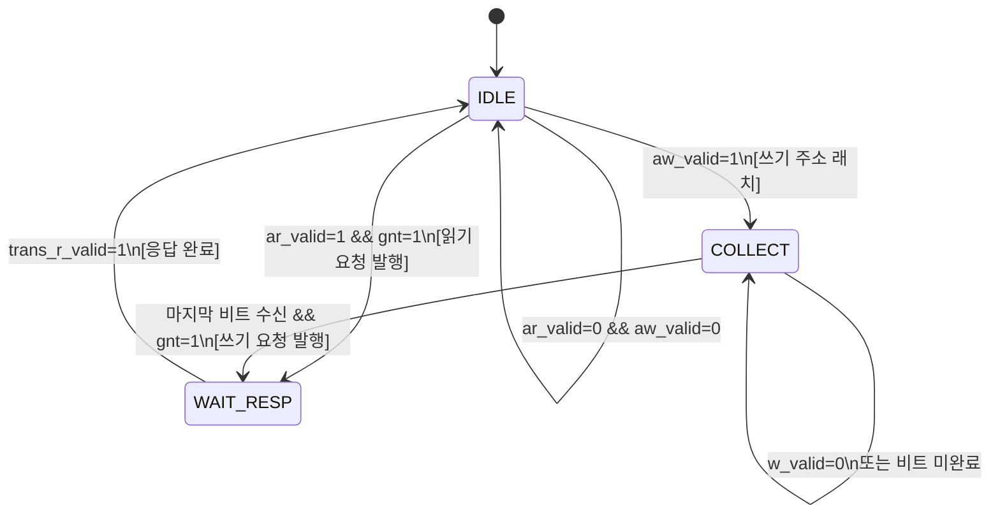

# axi2per_req_channel.sv — AXI 요청 채널 변환기

## 1. 개요

`axi2per_req_channel`은 AXI4의 읽기·쓰기 주소 및 쓰기 데이터 채널을 수신하여, PULP 주변장치의 **요청 채널** 신호를 생성하는 서브모듈입니다.

주요 기능:
- **읽기 요청**: AXI AR 채널 → 주변장치 req/add/we=0 즉시 발행
- **쓰기 요청**: AXI AW 채널로 주소 래치 후, W 채널에서 `BEAT_RATIO`개의 AXI 비트를 수집하여 단일 주변장치 쓰기 요청 발행
- **AXI ID 원-핫 변환**: 바이너리 AXI ID → PER_ID_WIDTH 비트 원-핫 인코딩
- **user 필드 전달**: aw_user(쓰기) / ar_user(읽기) → per_master_user_o

---

## 2. 파라미터

| 파라미터 | 기본값 | 설명 |
|---|---|---|
| `PER_ADDR_WIDTH` | 32 | 주변장치 주소 버스 폭 |
| `PER_DATA_WIDTH` | 256 | 주변장치 데이터 버스 폭 |
| `AXI_ADDR_WIDTH` | 32 | AXI 주소 버스 폭 |
| `AXI_DATA_WIDTH` | 64 | AXI 데이터 버스 폭 |
| `AXI_USER_WIDTH` | 6 | AXI user 신호 폭 |
| `AXI_ID_WIDTH` | 3 | AXI ID 폭 (바이너리) |
| `PER_ID_WIDTH` | `2**AXI_ID_WIDTH` | 주변장치 ID 폭 (원-핫) |
| `AXI_STRB_WIDTH` | `AXI_DATA_WIDTH/8` | AXI 스트로브 폭 |
| `PER_BE_WIDTH` | `PER_DATA_WIDTH/8` | 주변장치 바이트 인에이블 폭 |

### 파생 로컬파라미터

| 로컬파라미터 | 계산식 | 설명 |
|---|---|---|
| `AXI_BE_WIDTH` | `AXI_DATA_WIDTH/8` | AXI 비트당 바이트 수 |
| `BEAT_RATIO` | `PER_DATA_WIDTH/AXI_DATA_WIDTH` | 주변장치 워드 당 AXI 비트 수 |
| `SLOT_W` | `$clog2(BEAT_RATIO)` | 슬롯 인덱스 비트 폭 |

---

## 3. 포트

### 입력 — AXI 채널

| 포트 | 폭 | 설명 |
|---|---|---|
| `clk_i`, `rst_ni` | 1 | 클럭, 리셋 |
| `axi_slave_aw_valid_i` | 1 | AW 채널 유효 |
| `axi_slave_aw_addr_i` | AXI_ADDR_WIDTH | 쓰기 주소 |
| `axi_slave_aw_len_i` | 8 | 버스트 길이 (AXI: len+1 비트) |
| `axi_slave_aw_id_i` | AXI_ID_WIDTH | 트랜잭션 ID (바이너리) |
| `axi_slave_aw_user_i` | AXI_USER_WIDTH | 쓰기 주소 user 필드 |
| `axi_slave_aw_ready_o` | 1 | AW 핸드셰이크 ready |
| `axi_slave_ar_valid_i` | 1 | AR 채널 유효 |
| `axi_slave_ar_addr_i` | AXI_ADDR_WIDTH | 읽기 주소 |
| `axi_slave_ar_len_i` | 8 | 버스트 길이 |
| `axi_slave_ar_id_i` | AXI_ID_WIDTH | 트랜잭션 ID (바이너리) |
| `axi_slave_ar_user_i` | AXI_USER_WIDTH | 읽기 주소 user 필드 |
| `axi_slave_ar_ready_o` | 1 | AR 핸드셰이크 ready |
| `axi_slave_w_valid_i` | 1 | W 채널 유효 |
| `axi_slave_w_data_i` | AXI_DATA_WIDTH | 쓰기 데이터 |
| `axi_slave_w_strb_i` | AXI_STRB_WIDTH | 바이트 스트로브 |
| `axi_slave_w_last_i` | 1 | 마지막 비트 표시 |
| `axi_slave_w_ready_o` | 1 | W 핸드셰이크 ready |

### 출력 — 주변장치 요청 채널

| 포트 | 폭 | 설명 |
|---|---|---|
| `per_master_req_o` | 1 | 요청 유효 |
| `per_master_add_o` | PER_ADDR_WIDTH | 요청 주소 |
| `per_master_we_o` | 1 | **1=쓰기, 0=읽기** (PULP 표준) |
| `per_master_wdata_o` | PER_DATA_WIDTH | 쓰기 데이터 (수집된 전체 워드) |
| `per_master_be_o` | PER_BE_WIDTH | 바이트 인에이블 |
| `per_master_id_o` | PER_ID_WIDTH | **원-핫** 인코딩 ID |
| `per_master_user_o` | AXI_USER_WIDTH | user 필드 전달 |
| `per_master_gnt_i` | 1 | 주변장치 그랜트 (요청 수락) |

### 내부 트랜잭션 버스 (→ res_channel)

| 포트 | 폭 | 설명 |
|---|---|---|
| `trans_req_o` | 1 | 트랜잭션 정보 유효 |
| `trans_we_o` | 1 | **1=읽기, 0=쓰기** (내부 역전 관례) |
| `trans_id_o` | AXI_ID_WIDTH | 바이너리 AXI ID |
| `trans_add_o` | AXI_ADDR_WIDTH | 트랜잭션 주소 |
| `trans_len_o` | 8 | 버스트 길이 |
| `trans_r_valid_i` | 1 | res_channel에서: 응답 완료 |
| `busy_o` | 1 | 모듈 동작 중 |

---

## 4. 상태 머신 블록 다이어그램



---

## 5. 동작 상세

### 5-1. IDLE 상태

```
우선순위: 읽기(AR) > 쓰기(AW)

[읽기 요청]
  per_master_req_o = 1
  per_master_we_o  = 0  (0=읽기)
  per_master_add_o = ar_addr
  per_master_id_o  = 1'b1 << ar_id  (원-핫)
  per_master_user_o = ar_user
  gnt=1이면: ar_ready=1, trans_req=1, 상태→WAIT_RESP

[쓰기 주소 래치]
  aw_ready=1
  aw_addr_q, aw_id_q, aw_len_q, aw_user_q 저장
  beats_exp = aw_len + 1
  base_slot = addr[$clog2(PER_BE_WIDTH)-1 : $clog2(AXI_BE_WIDTH)]
  상태→COLLECT
```

### 5-2. COLLECT 상태 (쓰기 데이터 수집)

```
w_ready = 1  (항상 수용)

w_valid=1이면:
  wr_slot = base_slot_q + beat_cnt_q
  if (wr_slot < BEAT_RATIO):
    wdata_buf[wr_slot * AXI_DATA_WIDTH +: AXI_DATA_WIDTH] = w_data
    be_buf  [wr_slot * AXI_BE_WIDTH    +: AXI_BE_WIDTH  ] = w_strb
  beat_cnt++

마지막 비트(beat_cnt == beats_exp 또는 w_last):
  per_master_req_o  = 1
  per_master_we_o   = 1  (1=쓰기)
  per_master_add_o  = aw_addr_q
  per_master_wdata_o = wdata_buf_d (수집된 전체 워드)
  per_master_be_o   = be_buf_d
  per_master_id_o   = 1'b1 << aw_id_q  (원-핫)
  per_master_user_o = aw_user_q
  gnt=1이면: trans_req=1, 상태→WAIT_RESP
```

### 5-3. WAIT_RESP 상태

```
trans_r_valid_i=1이면: 상태→IDLE
(res_channel이 AXI R/B 응답을 완료했음을 통보)
```

---

## 6. 데이터 정렬 및 슬롯 계산

```
PER_DATA_WIDTH=512, AXI_DATA_WIDTH=128 예시:
  BEAT_RATIO = 512/128 = 4
  AXI_BE_WIDTH = 16 bytes
  PER_BE_WIDTH = 64 bytes

주소 0x0080:
  base_slot = addr[5:4] = 0x80[5:4] = 0b10 → 슬롯 2
  비트 0→슬롯 2, 비트 1→슬롯 3, 비트 2→슬롯 4(overflow→무시), ...

주소 0x0080은 슬롯 0 정렬(64바이트 경계):
  base_slot = 0x80 >> 4 & 3 = 8 & 3 = 0
  비트 0→슬롯 0, 비트 1→슬롯 1, 비트 2→슬롯 2, 비트 3→슬롯 3
```

> **권장**: 64바이트(PER_BE_WIDTH) 정렬된 주소를 사용하여 base_slot=0이 되도록 할 것

---

## 7. 원-핫 ID 인코딩 공식

```systemverilog
// 읽기
per_master_id_o = {{(PER_ID_WIDTH-1){1'b0}}, 1'b1} << axi_slave_ar_id_i;

// 쓰기
per_master_id_o = {{(PER_ID_WIDTH-1){1'b0}}, 1'b1} << aw_id_q;
```

---

## 8. 타이밍 다이어그램 (4비트 쓰기)

```
클럭:    ↑    ↑    ↑    ↑    ↑    ↑    ↑
상태:   IDLE  IDLE COLL COLL COLL COLL WAIT
aw_valid: 1    0
aw_ready: 0    1    0
w_valid:       1    1    1    1    0
w_last:             0    0    0    1
beat_cnt:           0    1    2    3
per_req:                           1
per_gnt:                           1
trans_req:                         1
```
