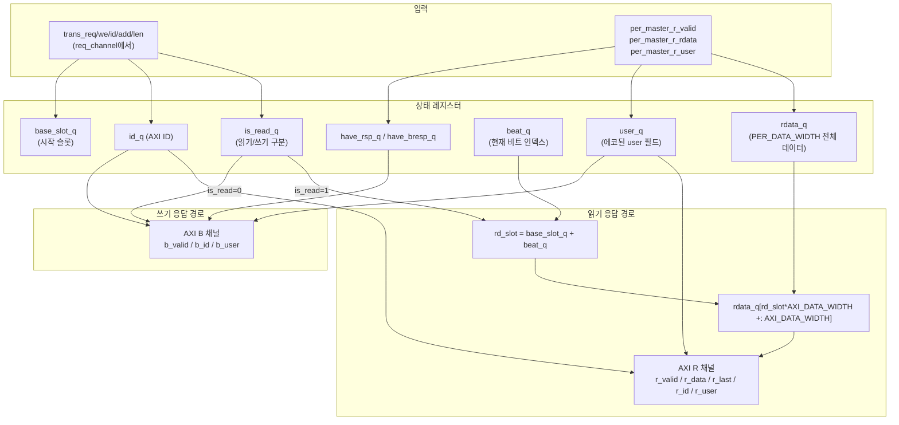

# axi2per_res_channel.sv — AXI 응답 채널 변환기

## 1. 개요

`axi2per_res_channel`은 PULP 주변장치의 **응답 채널**을 수신하여, AXI4의 읽기 데이터(R) 채널과 쓰기 응답(B) 채널을 생성하는 서브모듈입니다.

주요 기능:
- **읽기 응답**: 주변장치 r_rdata(PER_DATA_WIDTH 폭)를 AXI_DATA_WIDTH 크기의 비트로 분해하여 순서대로 출력 (BEAT_RATIO개 비트)
- **쓰기 응답**: 주변장치 r_valid(쓰기의 경우)를 AXI B채널 응답으로 변환
- **user 필드 전달**: per_master_r_user_i → axi_slave_r_user_o / axi_slave_b_user_o
- **ID 관리**: trans_id_i(바이너리 AXI ID)를 r_id_o, b_id_o로 반환

---

## 2. 파라미터

| 파라미터 | 기본값 | 설명 |
|---|---|---|
| `PER_ADDR_WIDTH` | 32 | 주변장치 주소 버스 폭 |
| `PER_DATA_WIDTH` | 256 | 주변장치 데이터 버스 폭 |
| `AXI_ADDR_WIDTH` | 32 | AXI 주소 버스 폭 |
| `AXI_DATA_WIDTH` | 64 | AXI 데이터 버스 폭 |
| `AXI_USER_WIDTH` | 6 | AXI user 신호 폭 |
| `AXI_ID_WIDTH` | 3 | AXI ID 폭 (바이너리) |
| `PER_ID_WIDTH` | `2**AXI_ID_WIDTH` | 주변장치 ID 폭 (원-핫) |

### 파생 로컬파라미터

| 로컬파라미터 | 계산식 | 설명 |
|---|---|---|
| `AXI_BE_WIDTH` | `AXI_DATA_WIDTH/8` | AXI 바이트 인에이블 폭 |
| `BEAT_RATIO` | `PER_DATA_WIDTH/AXI_DATA_WIDTH` | 주변장치 워드 당 AXI 비트 수 |
| `SLOT_W` | `$clog2(BEAT_RATIO)` | 슬롯 인덱스 비트 폭 |

---

## 3. 포트

### 입력 — 주변장치 응답 채널

| 포트 | 폭 | 설명 |
|---|---|---|
| `per_master_r_valid_i` | 1 | 주변장치 응답 유효 |
| `per_master_r_opc_i` | 1 | 응답 opcode (오류 코드, 현재 미사용) |
| `per_master_r_rdata_i` | PER_DATA_WIDTH | 읽기 응답 데이터 |
| `per_master_r_id_i` | PER_ID_WIDTH | 응답 ID (원-핫, 현재 직접 사용 안 함) |
| `per_master_r_user_i` | AXI_USER_WIDTH | 응답 user 필드 (에코됨) |

### 출력 — AXI R 채널 (읽기 데이터)

| 포트 | 폭 | 설명 |
|---|---|---|
| `axi_slave_r_valid_o` | 1 | 읽기 데이터 유효 |
| `axi_slave_r_data_o` | AXI_DATA_WIDTH | 읽기 데이터 (1비트) |
| `axi_slave_r_resp_o` | 2 | 응답 코드 (항상 OKAY=2'b00) |
| `axi_slave_r_last_o` | 1 | 마지막 비트 표시 |
| `axi_slave_r_id_o` | AXI_ID_WIDTH | 바이너리 AXI ID |
| `axi_slave_r_user_o` | AXI_USER_WIDTH | user 필드 (주변장치에서 에코) |
| `axi_slave_r_ready_i` | 1 | AXI 마스터 ready |

### 출력 — AXI B 채널 (쓰기 응답)

| 포트 | 폭 | 설명 |
|---|---|---|
| `axi_slave_b_valid_o` | 1 | 쓰기 응답 유효 |
| `axi_slave_b_resp_o` | 2 | 응답 코드 (항상 OKAY=2'b00) |
| `axi_slave_b_id_o` | AXI_ID_WIDTH | 바이너리 AXI ID |
| `axi_slave_b_user_o` | AXI_USER_WIDTH | user 필드 (주변장치에서 에코) |
| `axi_slave_b_ready_i` | 1 | AXI 마스터 ready |

### 내부 트랜잭션 버스 (← req_channel)

| 포트 | 폭 | 설명 |
|---|---|---|
| `trans_req_i` | 1 | 트랜잭션 정보 유효 |
| `trans_we_i` | 1 | **1=읽기, 0=쓰기** (내부 역전 관례) |
| `trans_id_i` | AXI_ID_WIDTH | 바이너리 AXI ID |
| `trans_add_i` | AXI_ADDR_WIDTH | 트랜잭션 주소 |
| `trans_len_i` | 8 | 버스트 길이 |
| `trans_r_valid_o` | 1 | 응답 완료 신호 (req_channel로) |

---

## 4. 내부 레지스터

| 레지스터 | 폭 | 설명 |
|---|---|---|
| `rdata_q` | PER_DATA_WIDTH | 캡처된 주변장치 읽기 데이터 |
| `id_q` | AXI_ID_WIDTH | 바이너리 AXI ID (트랜잭션에서 래치) |
| `user_q` | AXI_USER_WIDTH | 주변장치 응답 user 필드 (래치) |
| `len_q` | 8 | AXI 버스트 길이 |
| `is_read_q` | 1 | 읽기 트랜잭션 여부 (trans_we=1) |
| `base_slot_q` | SLOT_W | 첫 번째 AXI 비트 슬롯 인덱스 |
| `beat_q` | 8 | 현재 출력 중인 AXI 비트 인덱스 |
| `have_rsp_q` | 1 | 읽기 응답 데이터 보유 중 |
| `have_bresp_q` | 1 | 쓰기 응답 대기 중 |

---

## 5. 블록 다이어그램



---

## 6. 동작 상세

### 6-1. 트랜잭션 래치 (trans_req_i 수신 시)

```systemverilog
// clk 상승 엣지, trans_req_i=1일 때
is_read_q   <= trans_we_i;           // 1=읽기, 0=쓰기
id_q        <= trans_id_i;           // 바이너리 AXI ID 저장
len_q       <= trans_len_i;          // 버스트 길이 저장
beat_q      <= 0;                    // 비트 카운터 초기화
base_slot_q <= trans_add_i[$clog2(PER_DATA_WIDTH/8)-1 : $clog2(AXI_BE_WIDTH)];
```

### 6-2. 주변장치 응답 수신 (per_master_r_valid_i)

```systemverilog
user_q <= per_master_r_user_i;  // user 필드 캡처 (읽기/쓰기 공통)

if (is_read_q) begin
    rdata_q    <= per_master_r_rdata_i;  // 읽기 데이터 저장
    have_rsp_q <= 1'b1;                  // 읽기 응답 보유 플래그
    beat_q     <= 0;
end else begin
    have_bresp_q <= 1'b1;                // 쓰기 응답 보유 플래그
end
```

### 6-3. 읽기 데이터 출력 (비트 단위)

```systemverilog
rd_slot = base_slot_q + beat_q;  // 현재 비트 슬롯 계산
axi_slave_r_valid_o = have_rsp_q;
axi_slave_r_data_o  = rdata_q[rd_slot * AXI_DATA_WIDTH +: AXI_DATA_WIDTH];
axi_slave_r_last_o  = (beat_q == len_q);  // 마지막 비트

// 핸드셰이크 완료 시
if (r_valid && r_ready && !r_last)  beat_q++;
if (r_valid && r_ready &&  r_last)  have_rsp_q <= 0;  // 완료
```

### 6-4. 쓰기 응답 출력

```systemverilog
axi_slave_b_valid_o = have_bresp_q;
// b_ready=1이면 trans_r_valid_o=1 → req_channel에 완료 통보
```

---

## 7. 비트 슬라이싱 예시

```
설정: PER_DATA_WIDTH=512, AXI_DATA_WIDTH=128, BEAT_RATIO=4
주소: 0x0080 → base_slot = addr[5:4] = 0

주변장치 r_rdata (512비트):
  [511:384] = beat 3 데이터
  [383:256] = beat 2 데이터
  [255:128] = beat 1 데이터
  [127:  0] = beat 0 데이터

출력 순서:
  beat=0: rdata_q[  0*128 +: 128] = rdata_q[127:0]   → r_data
  beat=1: rdata_q[  1*128 +: 128] = rdata_q[255:128]  → r_data
  beat=2: rdata_q[  2*128 +: 128] = rdata_q[383:256]  → r_data (last)
  beat=3: rdata_q[  3*128 +: 128] = rdata_q[511:384]  → r_data (last)
```

---

## 8. user 필드 전달 경로

```
쓰기:
  AXI AW (aw_user) → req_channel.per_master_user_o
  → per_slave (user_i 에코 → r_user_o)
  → res_channel.per_master_r_user_i → user_q
  → axi_slave_b_user_o

읽기:
  AXI AR (ar_user) → req_channel.per_master_user_o
  → per_slave (user_i 에코 → r_user_o)
  → res_channel.per_master_r_user_i → user_q
  → axi_slave_r_user_o (모든 비트에서 동일한 값 출력)
```

---

## 9. trans_r_valid_o 생성 조건

| 트랜잭션 종류 | 조건 | 설명 |
|---|---|---|
| 읽기 | `r_valid && r_ready && r_last` | 마지막 비트 핸드셰이크 완료 |
| 쓰기 | `b_valid && b_ready` | B채널 핸드셰이크 완료 |
